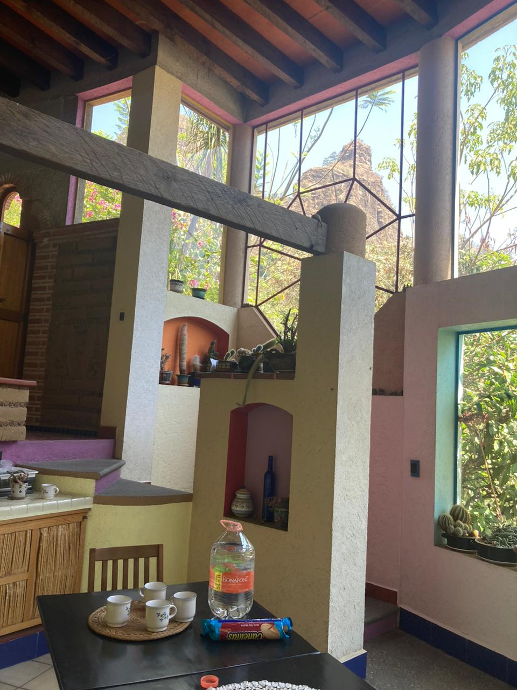
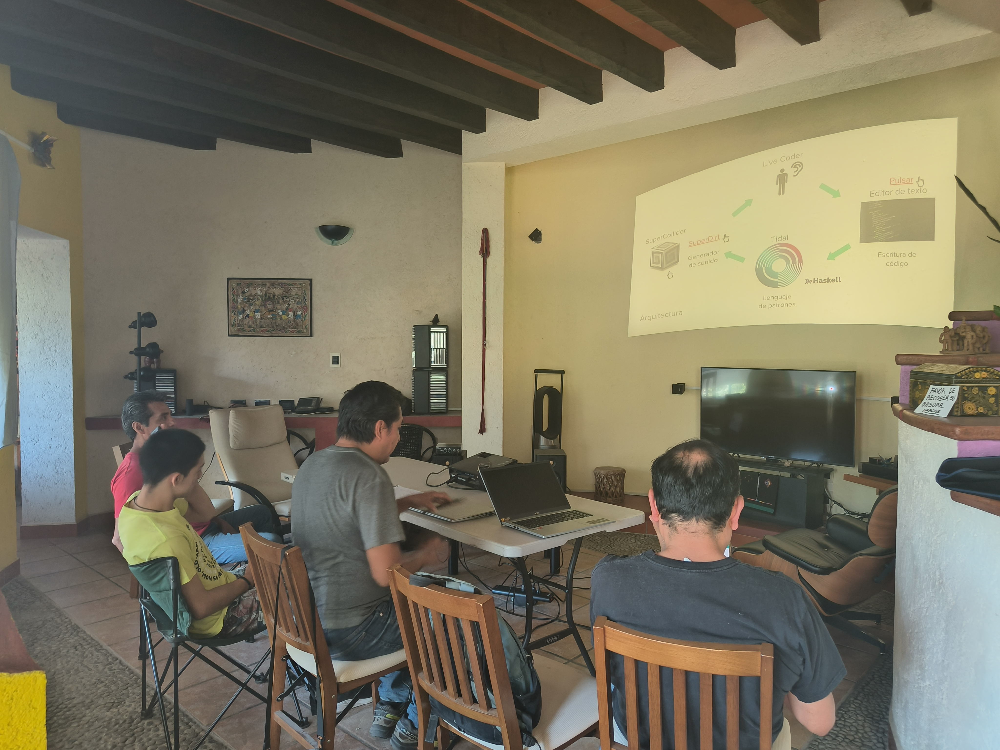
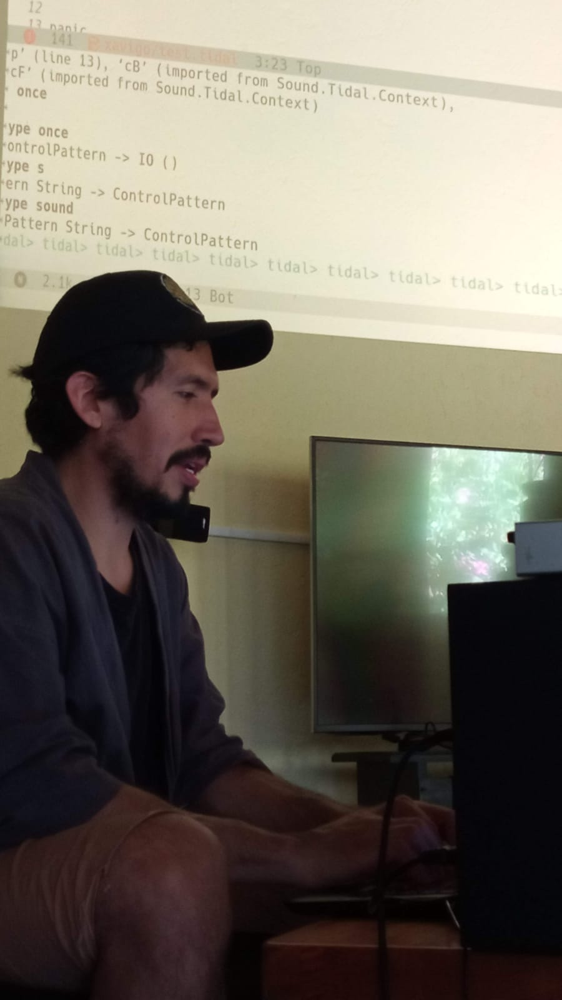

Last year I got a Tidal Cycles micro-grant in October to organize a live coding introductory workshop in Tepoztlán.
My first son was born the month after and it all has been quite=z a ride since!
This little person is quite demanding, but also incredibly inspiring.
I was finally able to give the workshop this year on March 24.

## Tepoztlán

Tepoztlán is located about 70 kilometers south of Mexico City, in a valley of steep mountains (that seem to have been pushed out from the underground) and lush glens during rainy season.
It is a town proud of its traditions, remarkable by its cultural and religious syncretism.
I've been living here for 7 years, and will continue for the foreseeable future. I hope my son grows to love its many faces and secrets.

We are currently facing environmental and social imbalance caused by a complex
real state black market that neglects the National Park status and regulations,
besides the annual fires that threaten the ecosystem.
In this context, nurturing community is critical to counteract the dismantling of the social fabric. 
This is no easy task, as the social spheres seem to orbit different stars at times. 
Giving this workshop is a first step for me to share my artistic and research interests with my local community, as most of my activities are usually online or in Mexico City. This is about creating a space to share, build knowledge and connect.

## The assistants and the venue

Four people came to the workshop. Alejandro is an economist but works as a carpenter for a living.
Roberto is a front-end developer and environmental activist that links the preservation of the mountains and forests with 
the rights of the indigenous people of Tepoztlán.
A second Alejandro is a high school senior involved with his neighborhood committee who he wants to study to become a mechatronics engineer.
Finally, Oscar is a systems engineer and part of the Forest Ranger Association of Tepoztlán.

The venue was Fernando Martín Juez's house, an architect and designer that left his house to become a Cultural Center after his passing.
He made the necessary arrangements for an association of friends and neighbors to manage the place and make it a contribution to the town people.
Unfortunately, the funds he left to kickstart activities are being held hostage by the bank (legal action can take ages), 
and the doors have been held shut except for some isolated events.
The house has an exotic architecture, a rich color palette, and is full of little artifacts that Fernando collected.
It was really a nice place to held the workshop, and hopefully could become a meeting point for the group.

## The workshop

For the first half of the workshop I gave a talk for context.
First I discussed what free and open source software is, and how it is
a strategy to harness community efforts and build community centered technology.
Then I talked about what live coding is in general, sharing some online references and
explained broadly what it all meant in the context of computer music practice.
This set the stage to talk about Tidal's architechture and finally showing a video of Alex Mclean (Tidal's creator)
doing a from-scratch session.
The slide presentation is available [here](https://docs.google.com/presentation/d/e/2PACX-1vQ8h38f0t9CYkyP1UftIe1l-mmtrQjxeYh7i5sU4nfKoINEiV3xXKlgnFXlWsV3QWcKoNI94d-5RFfU/pub?start=false&loop=false&delayms=0).

For the second half we went hands on.
I briefly introduced the Tidal installation procedure with reference to the official documentation for them to install at home.
Then I made a live demonstration showing the basic of sound reproduction, the mini-notation and some pattern combinators and
transformations (like `fast`, `slow`, `(<~)`, `jux` and `rev`). I also talked about functions inputs and outputs, as a mean
to understand Tidal's syntax.
Then we used [estuary](https://estuary.mcmaster.ca) as an improvisation hub to avoid installation and start coding right away.
It was fun seeing then go wild with the few functions I showed them.

## Aftermath

In this first workshop I might have overwhelmed the participants by showing too much notation too soon.
Introducing syntax elements and functions one at a time to build confidence will be the starting point next time.

Talking about next time, I'm thinking we will go through an introductory tutorial together. 
Hopefully more people will join by word of mouth. But to be honest, its enough for me to share with at least
one person and making Fernando's house sound funny.
