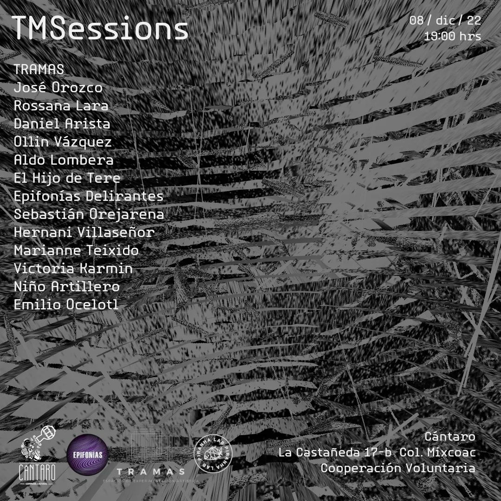
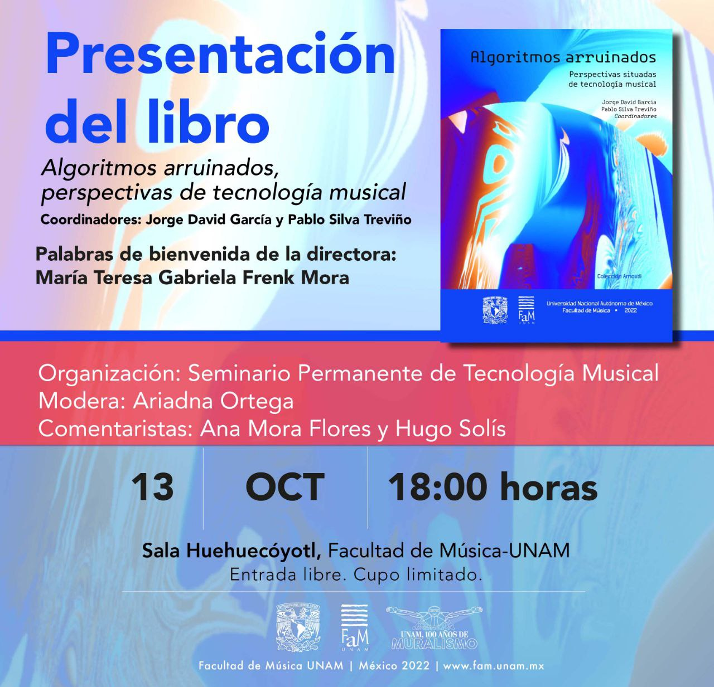
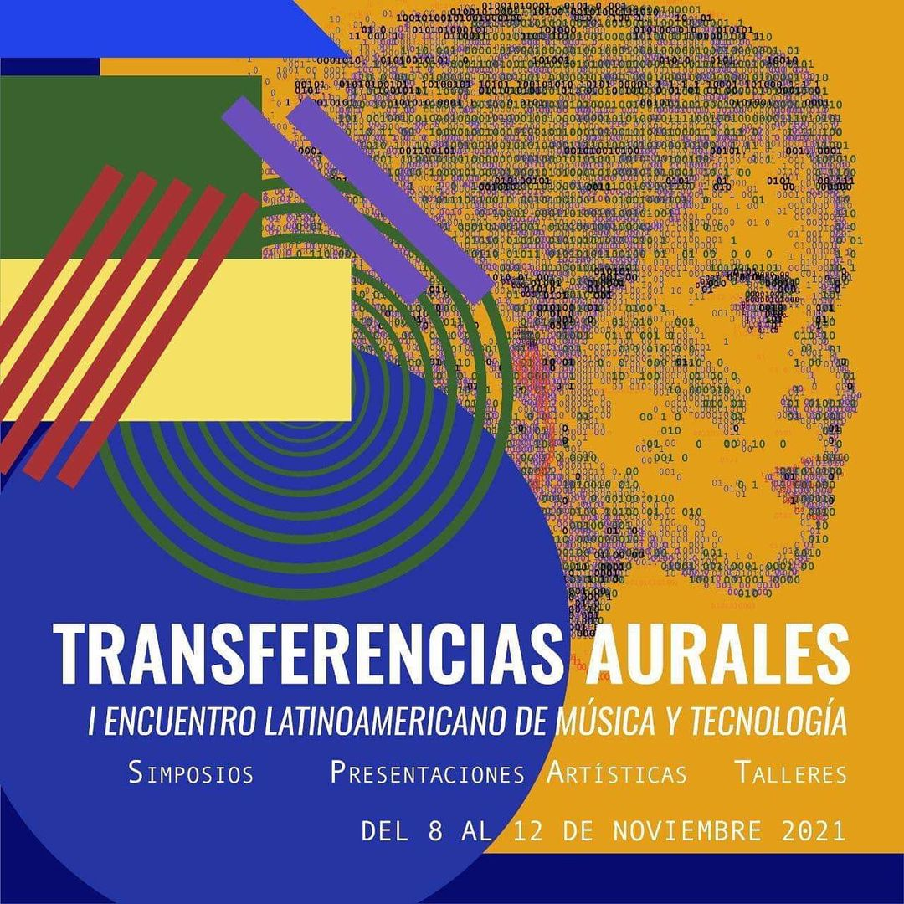

## TMSessions

2022.12.08

Concierto en el que participaron varios integrantes del SPTM.

## Presentación de "Algoritmos Arruinados"

2022.10.13

Este libro comprende un conjunto de reflexiones situadas en torno a la tecnología musical, trazando un mapa de este campo en el posgrado de la UNAM. Se publico bajo una licencia [Creative Commons](https://creativecommons.org/licenses/by-nc-nd/4.0/legalcode.es) y puede ser consultado en línea en el [repositorio de la Facultad de Música](https://www.repositorio.fam.unam.mx/handle/123456789/139).

## Transferencias Aurales

2021-11-08 al 2021-11-12

Primer encuentro latinoamericano de música y tecnología, organizado por integrantes del SPTM.

* [Convocatoria](https://www.fam.unam.mx/difusion/cartel/Transferencias-Aurales-convocatoria.pdf)
* [Programa oficial](https://www.fam.unam.mx/difusion/cartel/programa-y-registro-transferenciasaurales.pdf)
* [Registro y memoria](https://limmefamus.wordpress.com/transferencias-aurales/)

