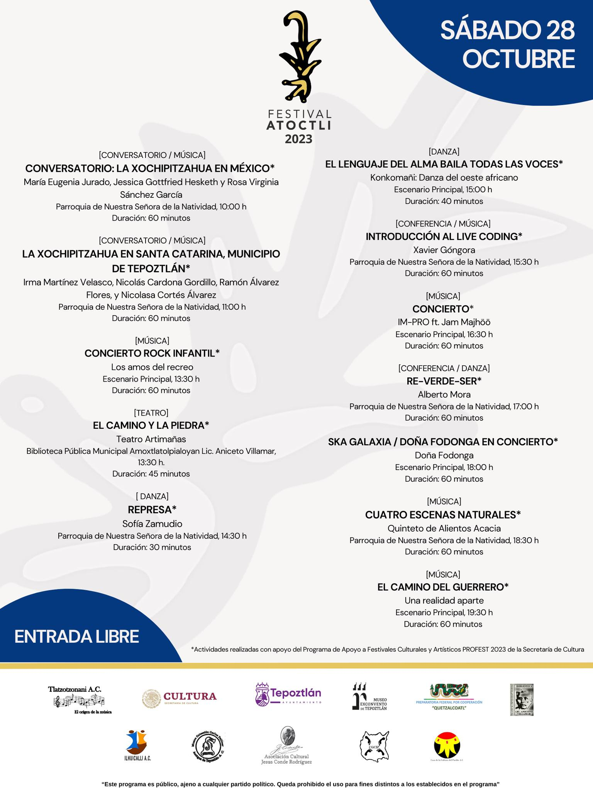

## Algorithmic Pattern Salon

2023.11.30

[Ponencia](https://www.youtube.com/watch?v=lvxwg-h10Tw&t=7421s&list=PLxqmZjMvoVzzhyTQab_DCEqDIthsAiDzF&index=4) en el encuentro [Algorithmic Pattern Salon](https://salon.algorithmicpattern.org/)
presentando mi artículo [Rhythm, Time and Geometry](https://alpaca.pubpub.org/pub/s96d870n).

## [Festival Atoctli 2023](actividades/2023-atoctli.html)

2023.10.28

Conferencia "Introducción al live coding". En la Parroquia de la Natividad, Tepoztlán, Morelos.

## [TMSessions](actividades/2022-tmsessions.html)

2022.12.08

Concierto con la participación de varios integrantes del SPTM.

## [Presentación de "Algoritmos Arruinados"](actividades/2022-algoritmos-arruinados.html)

2022.10.13

Este libro comprende un conjunto de reflexiones situadas en torno a la tecnología musical, trazando un mapa de este campo en el posgrado de la UNAM. Se publico bajo una licencia [Creative Commons](https://creativecommons.org/licenses/by-nc-nd/4.0/legalcode.es) y puede ser consultado en línea en el [repositorio de la Facultad de Música](https://www.repositorio.fam.unam.mx/handle/123456789/139). Gestionado y escrito por el SPTM.

## Transferencias Aurales

2021-11-08 al 2021-11-12

Primer encuentro latinoamericano de música y tecnología, organizado por el SPTM.

* [Convocatoria](https://www.fam.unam.mx/difusion/cartel/Transferencias-Aurales-convocatoria.pdf)
* [Programa oficial](https://www.fam.unam.mx/difusion/cartel/programa-y-registro-transferenciasaurales.pdf)
* [Registro y memoria](https://limmefamus.wordpress.com/transferencias-aurales/)

