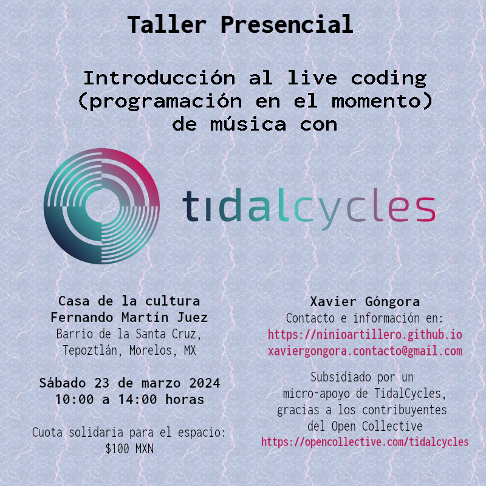



### Información

Un taller de iniciación en el uso de [Tidal Cycles](https://tidalcycles.org/) para crear música en el momento.[^acknowledge]

* El objetivo es dar a conocer la práctica del _live coding_ en Tepoztlán e iniciar un grupo de estudio y creación musical.
* Dirigido a músicos y no-músicos interesados en las posibilidades creativas de la programación.
* Abierto a todo público a partir de 13 años de edad.
* No se requiere ningún conocimiento previo en música o programación.
* Aunque no es requisito, se recomienda traer una computadora portátil.
* Cupo limitado.

Si estás interesadx ponte en [contacto](mailto:xaviergongora.contacto@gmail.com).

[^acknowledge]: Este taller es posible gracias a un micro-apoyo otorgado por Tidal Cycles en nombre de sus contribuyentes del opencollective: [https://opencollective.com/tidalcycles](https://opencollective.com/tidalcycles)
